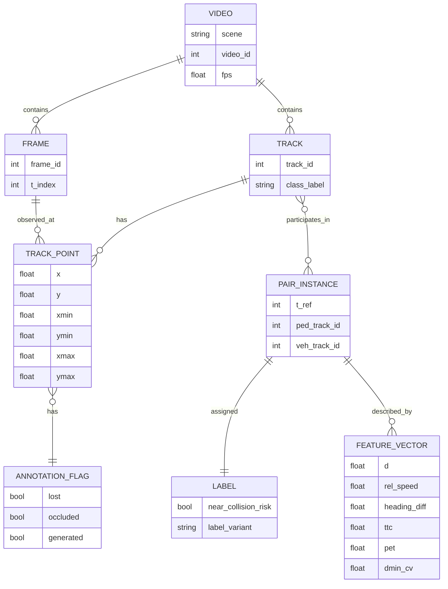

# Predicting Pedestrian–Vehicle Near-Collision Risk Using Engineered Trajectory Features

## Executive Summary

**Abstract**  
This paper develops and documents a trajectory-only methodology for **classifying pedestrian–vehicle near-collision risk** using **engineered geometric features** derived from bounding-box tracks in the **Stanford Drone Dataset (SDD)**. SDD provides aerial videos with per-frame object annotations (bounding boxes, track IDs, class labels) across multiple campus scenes. The paper contributes a reproducible, citation-grounded **rule-based labeling scheme** to define “near-collision risk” as a **surrogate safety event** (not a police-reported crash), building on the traffic conflict and surrogate safety measures literature (e.g., TTC, PET). The modeling approach compares a **naive proximity threshold baseline** against classical tabular ML models (logistic regression, random forest, XGBoost) trained on engineered features (distance, relative velocity, heading difference, cosine similarity, time-to-collision, post-encroachment time, distance trend, and projected-path distance). Performance will be reported using precision, recall, F1, ROC-AUC, calibration diagnostics, and sensitivity/ablation analyses. Empirical results, figures, and final conclusions are intentionally left as placeholders (e.g., **[INSERT RESULTS]**, **[INSERT FIGURE]**, **[INCLUDE CONCLUSIONS HERE]**). citeturn4view1turn8view0turn17view0turn25view1

**Executive Summary**  
Pedestrian–vehicle interaction risk is a core challenge in intelligent transportation systems and autonomous driving because pedestrians are vulnerable road users and their motion can be difficult to predict and interpret in real-world scenes. citeturn1search0turn21search2turn22search1 Trajectory-based risk estimation is attractive when video pixels and rich semantic labels are unavailable or out of scope: when two agents move through shared space on converging paths, collision likelihood can often be described (approximately) through geometry and motion kinematics. citeturn16view0turn16view1turn25view1

This scaffolded paper is designed around two methodological realities:

First, **SDD does not provide explicit collision labels**, so the learning target must be constructed. This paper therefore defines near-collision risk using **surrogate safety measures** and **traffic conflict** concepts, consistent with longstanding transportation safety practice where conflicts and near-misses are used when crash records are sparse or unavailable. citeturn16view0turn16view1turn17view0turn15view0

Second, SDD has known **annotation and splitting pitfalls** (e.g., “lost” segments, split trajectories, overlapping videos in time/location). These can cause label noise, leakage, or misleading evaluation if not handled explicitly. citeturn8view0turn12view3turn4view0

This paper’s methodological contribution is therefore not a claim of superior predictive performance, but a **reproducible, citation-backed pipeline** to (a) construct risk labels from trajectories, (b) engineer interpretable trajectory features, (c) compare classical ML models to a proximity-only baseline, and (d) report results with appropriate sensitivity and limitations. citeturn17view0turn25view1turn2search1turn2search2

**How to use this scaffold**  
Everywhere empirical work is required, this paper uses placeholders. You should replace them with your actual dataset statistics, tables, and figures, and update any “unspecified” design choices once you decide them. This document does not assume or fabricate outcomes. citeturn17view0turn8view0turn20search6

## Background and Related Work

**Introduction**  
Urban pedestrian–vehicle interaction is safety-critical because pedestrians are highly vulnerable and because ambiguity in intent, attention, and right-of-way can produce complex interaction dynamics. citeturn1search0turn21search14turn22search3 In autonomous driving research, anticipating pedestrian movement and interaction outcomes (e.g., crossing vs yielding) is widely treated as a prerequisite for safe planning and human-compatible behavior. citeturn1search0turn22search1turn21search2

While many approaches model risk from camera imagery or multimodal sensor streams, trajectory-only approaches remain practically relevant in settings where (i) only tracked positions are available, (ii) privacy constraints limit raw video use, or (iii) interpretability and computational simplicity are prioritized. citeturn16view0turn15view0turn2search2 Trajectory-only approaches also align with the traffic safety tradition of **conflict analysis**, where risk is analyzed through near-miss events and surrogate indicators such as time-to-collision (TTC) and post-encroachment time (PET). citeturn16view1turn17view0turn25view1

This paper focuses on the following research question (to be finalized in your final draft):  
**Do engineered geometric trajectory features outperform a naive proximity baseline for classifying rule-defined pedestrian–vehicle near-collision risk in SDD?**  
This question is framed deliberately as **rule-defined near-collision risk** rather than real-world crash prediction, because SDD provides trajectories and object labels but not collision outcomes. citeturn8view0turn4view1turn17view0

**Related Work**  
Trajectory forecasting has a large literature spanning classic hand-crafted interaction models and modern deep learning approaches. Reviews emphasize that forecasting in pedestrian–vehicle mixed environments requires modeling interaction effects and that datasets and evaluation protocols vary widely. citeturn22search1turn14search0turn29search20 The Stanford Drone Dataset is widely used as a benchmark for trajectory forecasting and social navigation in top-down scenes, while more recent benchmarks seek standardized splits and interaction-centric sampling. citeturn4view1turn1search1turn1search6turn14search2

Prominent deep-learning trajectory forecasting baselines that have used SDD (among other datasets) include **Social LSTM**, **Social GAN**, and **SoPhie**, which highlight the importance of interaction modeling and multimodality. citeturn28search0turn1search1turn1search6 Broader benchmarking efforts such as OpenTraj and TrajNet++ focus on dataset complexity, interaction-centric evaluation, and consistent preprocessing. citeturn22search0turn10view1turn14search3

For this paper’s purposes, deep learning forecasting models are cited primarily to contextualize SDD as a benchmark and to motivate why trajectory geometry contains meaningful interaction information. This work does **not** assume deep models are required for the classification task, since course project goals often prioritize clarity and methodological rigor over state-of-the-art performance. fileciteturn0file1L12-L24 citeturn2search1turn2search3turn20search6

The **traffic conflicts / surrogate safety** literature is directly relevant because it provides operational definitions of near-miss and conflict events in the absence of crash labels. Early foundational work proposed measuring near-miss severity by time until collision. citeturn16view1turn3search0 Later work in traffic conflict techniques articulates conflict event sequences, and defines indicators including gap time, TTC, and PET. citeturn25view0turn25view1turn17view0 FHWA work on surrogate measures and SSAM formalizes conflict indicators and emphasizes the practical motivation for surrogate approaches when crash counts are sparse or unavailable. citeturn17view0turn15view0turn16view0

On the modeling side, classical tabular ML methods remain common in traffic safety prediction tasks and are frequently paired with explainability techniques such as SHAP. citeturn2search0turn1search3turn2search2 XGBoost is a canonical, scalable gradient-boosted tree system, random forests are a standard ensemble baseline, and SHAP provides a unified feature attribution framework. citeturn2search1turn2search3turn2search2

## Data and Label Construction

**Dataset: Stanford Drone Dataset**  
The **Stanford Drone Dataset (SDD)** provides drone-view videos of eight campus scenes, with multiple object classes (pedestrians, bicyclists, skateboarders, carts, cars, buses) and per-frame annotation data. citeturn4view1turn8view0 SDD is commonly described as containing **60 videos across 8 scenes** (campus setting) and annotated classes beyond pedestrians, making it attractive for multi-class interaction research. citeturn8view0turn4view1

SDD annotations include bounding-box coordinates in **pixel space** and are available at **30 frames per second** in the original annotations, with fields indicating occlusion, out-of-view (“lost”), and interpolation (“generated”). citeturn8view0turn12view3turn10view1 The SDD license is Creative Commons Attribution–NonCommercial–ShareAlike 3.0 on the official dataset page, which constrains usage and redistribution. citeturn4view1

**Annotation structure and fields**  
The widely used parsing format for SDD “annotations.txt” files corresponds to rows containing at least the following fields: track ID, xmin, ymin, xmax, ymax, frame index, lost, occluded, generated, and label (class). citeturn4view0turn7search3turn7search7 In particular, the “lost” indicator is intended to mark annotations outside the view screen, and “generated” indicates interpolated annotations. citeturn4view0turn12view3

Because multiple repositories and toolkits redistribute subsets or reformatted versions of SDD annotations, your empirical work should verify the exact column order and delimiters from the version you download, then document that in **[INSERT DATA APPENDIX]**. citeturn4view0turn10view1turn8view0

**Known SDD limitations relevant to this project**  
SDD’s “lost” annotations and trajectory splitting can materially affect downstream modeling if not filtered properly; analyses show that “lost” points can create apparent stationary segments or false interactions if treated as valid coordinates. citeturn8view0turn12view3 SDD also contains videos that may overlap in time and location within a scene, which complicates train/test splitting and can create leakage if not handled carefully. citeturn8view0turn12view3 Additionally, SDD’s class mix can be pedestrian-dominated in many scenes and may include many parked or infrequent vehicles, affecting the availability of meaningful pedestrian–vehicle interactions. citeturn12view0turn4view1 These issues motivate conservative preprocessing, grouping-based splits, and label noise analysis in this paper. citeturn8view0turn19search1turn18search1

**Defining “near-collision risk” using surrogate safety and traffic conflict concepts**  
Because SDD does not label collisions, this paper defines “near-collision risk” using concepts from **traffic conflict techniques** and **surrogate safety measures**, where a “conflict” is often described as a situation in which road users approach each other in space and time such that a collision risk exists if movements remain unchanged. citeturn16view0turn23search0 Early near-miss work proposed the “time measured until collision” as a physically measurable danger scale for identifying near-miss situations. citeturn16view1turn3search0

Surrogate safety measures frequently used in the conflict literature include TTC and PET. FHWA work defines TTC as the expected time for two vehicles to collide if they remain at their present speed and on the same path, and PET as a time lapse between one road user leaving a conflict area and the other arriving. citeturn17view0turn25view1turn15view0 The TRR conflict analysis literature also defines PET as the time from end of encroachment to when the other user actually arrives at the potential collision point, interpreting PET approaching zero as a near miss by a very small margin. citeturn25view1turn24view0

**Rule-based labeling: design goals**  
The label should satisfy three constraints:

1. **Operational computability from trajectories** (no scene semantics required). citeturn17view0turn8view0  
2. **Alignment with surrogate safety concepts** (risk is tied to proximity plus timing/convergence). citeturn16view1turn17view0turn25view1  
3. **Robustness to SDD idiosyncrasies** (lost/occluded points; discontinuities; limited vehicle prevalence). citeturn8view0turn12view3  

**Rule-based label definitions (scaffold with parameters left unspecified)**  
Let a pedestrian track \(p\) and vehicle track \(v\) be observed at time indices \(t\) in an observation window \([t-k+1, \dots, t]\), and define a **prediction horizon** \(h\) time steps into the future. (The choice of \(k\) and \(h\) is an explicit design variable; common trajectory forecasting setups downsample SDD and use 8 observed and 12 predicted time points, but this paper does not assume you will adopt that exact protocol.) citeturn12view3turn10view1

This paper proposes maintaining multiple label variants in parallel, then treating label choice as a sensitivity factor rather than a single ground truth.

**Label Variant A: Proximity-only near miss (for diagnostic comparison, not the main label)**  
A pair is labeled risky at time \(t\) if the **minimum distance** over the future horizon is below a threshold:

\[
y^{(A)}_{t}(p,v) =
\begin{cases}
1 & \text{if } \min_{\tau \in [t+1, t+h]} d(p_\tau, v_\tau) \le d_{\min} \\
0 & \text{otherwise}
\end{cases}
\]

This captures “they got close” but does not enforce a convergence notion; it is thus best used as a diagnostic and will likely produce many false positives in situations where agents are close but diverging. citeturn16view0turn3search2turn17view1

**Label Variant B: TTC-filtered near-collision risk (main candidate)**  
Motivated by TTC’s role as a primary conflict severity measure and its grounding as “expected time to collision if motion is unchanged,” define a pair as risky if:
- the predicted **time-to-collision** is finite and below a threshold, and
- the predicted **closest approach distance** under constant-velocity motion is below a distance threshold.

Define at time \(t\) the relative position \(r_t\) and relative velocity \(u_t\) (definitions and computation in the Feature Engineering section). Then:

\[
y^{(B)}_{t}(p,v) =
\mathbb{1}\left(\mathrm{TTC}_t \in (0, \tau_{\mathrm{TTC}}] \;\wedge\; d^{\mathrm{cv}}_{\min,t} \le d_{\min}\right)
\]

where \(\tau_{\mathrm{TTC}}\) and \(d_{\min}\) are thresholds to be chosen (not assumed here). This definition operationalizes the conflict literature’s “if movements remain unchanged” criterion through constant-velocity extrapolation. citeturn16view0turn17view0turn25view1

**Label Variant C: PET-based crossing risk (secondary candidate for crossing-like interactions)**  
PET is typically defined relative to a conflict point (where paths intersect). For each pair at time \(t\), define an estimated conflict point \(c_t\) from extrapolated motion in the horizon. Then define:

\[
y^{(C)}_{t}(p,v)=\mathbb{1}\left(\mathrm{PET}_t \le \tau_{\mathrm{PET}} \;\wedge\; d^{\mathrm{cv}}_{\min,t} \le d_{\min}\right)
\]

PET is particularly meaningful for crossing conflicts and is often described as a measure of “near misses.” citeturn25view1turn17view0turn23search11 Because PET requires conflict-point estimation, this variant should be evaluated with caution in free-flow campus scenes where extrapolated path intersections may be unstable. citeturn8view0turn12view0

**Filtering and validity rules (recommended, but to be empirically justified)**  
To reduce label noise, the paper recommends explicit filters that should be documented and ablated:

- Exclude time steps where either track has lost=1, because including out-of-bounds “lost” frames can create spurious apparent interactions. citeturn4view0turn8view0  
- Decide whether to exclude occluded=1 points or keep them with smoothing; SDD explicitly marks occlusions, so this choice should be reported and tested. citeturn4view0turn8view0  
- Exclude pairs where relative speed is near zero (TTC undefined/unstable) unless your label variant is purely proximity-based. citeturn3search2turn17view0  

**Threshold selection strategy for label parameters (\(d_{\min}, \tau_{\mathrm{TTC}}, \tau_{\mathrm{PET}}\))**  
This paper explicitly avoids prescribing numeric thresholds because (i) units may be pixels or meters depending on whether you apply calibration, and (ii) threshold choice is inherently context-sensitive in surrogate safety practice. citeturn16view0turn17view1turn23search11 Instead, thresholds should be determined through a documented selection procedure such as:
- selecting values based on **percentiles** of observed near-min distances / TTC values after cleaning, or  
- searching a grid of plausible thresholds and choosing those producing stable event rates and interpretable examples, or  
- tuning thresholds to maximize consistency with qualitative near-miss examples inspected from trajectories. citeturn16view1turn25view1turn8view0  

All of these choices should be treated as assumptions and included in a label sensitivity analysis plan (see Discussion). citeturn23search11turn18search1turn19search1

## Feature Engineering

This section defines the feature set and how to compute it from SDD annotations. All features are engineered from **2D trajectories** derived from SDD bounding boxes in pixel coordinates; optional conversion to metric coordinates is discussed as an assumption rather than a requirement. citeturn8view0turn4view0turn10view1

**Trajectory point representation from bounding boxes (design choice to document)**  
Given SDD bounding boxes \((x_{\min}, y_{\min}, x_{\max}, y_{\max})\), define an agent’s location as:

\[
\mathbf{x}_t = \left(\frac{x_{\min,t}+x_{\max,t}}{2},\; \frac{y_{\min,t}+y_{\max,t}}{2}\right)
\]

(center of the box). This is a pragmatic choice for top-down views, but you should document and optionally compare alternatives (e.g., bottom-middle). The chosen point affects velocity and derived features; therefore, it should be fixed consistently across the pipeline. citeturn4view0turn8view0turn10view1

**Time step and units**  
SDD annotations are available at 30 FPS (native), so if you use the full frame rate then \(\Delta t \approx 1/30\) seconds. Many trajectory prediction benchmarks downsample SDD (e.g., to 2.5 FPS) for comparability and smoother dynamics; if you downsample then \(\Delta t\) changes accordingly and must be documented. citeturn12view3turn10view1turn8view0

**Core kinematic definitions**  
For an agent \(a \in \{p,v\}\) (pedestrian or vehicle), with positions \(\mathbf{x}^a_t \in \mathbb{R}^2\):

Discrete velocity (backward difference):

\[
\mathbf{\dot{x}}^a_t = \frac{\mathbf{x}^a_t - \mathbf{x}^a_{t-1}}{\Delta t}
\]

Discrete acceleration (optional):

\[
\mathbf{\ddot{x}}^a_t = \frac{\mathbf{\dot{x}}^a_t - \mathbf{\dot{x}}^a_{t-1}}{\Delta t}
\]

Relative position and relative velocity:

\[
\mathbf{r}_t = \mathbf{x}^p_t - \mathbf{x}^v_t,\quad \mathbf{u}_t = \mathbf{\dot{x}}^p_t - \mathbf{\dot{x}}^v_t
\]

Distance:

\[
d_t = \|\mathbf{r}_t\|_2
\]

These constructs enable TTC and closest-approach features used in surrogate safety measure computations. citeturn17view0turn25view1turn3search2

**Feature table: formulas and expected units**  
The following table lists recommended features for the tabular ML models. Units depend on whether you remain in pixels or convert to meters; this paper treats units as an explicit assumption to document.

| Feature | Symbol | Definition / Formula | Expected units |
|---|---:|---|---|
| Distance | \(d_t\) | \(\|\mathbf{x}^p_t - \mathbf{x}^v_t\|_2\) | pixels or meters |
| Relative velocity vector | \(\mathbf{u}_t\) | \(\mathbf{\dot{x}}^p_t - \mathbf{\dot{x}}^v_t\) | (px/s) or (m/s) |
| Relative speed magnitude | \(\|\mathbf{u}_t\|\) | \(\sqrt{u_{x,t}^2 + u_{y,t}^2}\) | px/s or m/s |
| Heading vectors | \(\hat{\mathbf{v}}^a_t\) | \(\mathbf{\dot{x}}^a_t / \|\mathbf{\dot{x}}^a_t\|\) if \(\|\mathbf{\dot{x}}^a_t\|>0\) | unitless |
| Heading difference | \(\theta_t\) | \(\arccos\left(\mathrm{clip}\left(\hat{\mathbf{v}}^p_t \cdot \hat{\mathbf{v}}^v_t,-1,1\right)\right)\) | radians |
| Cosine similarity | \(\cos\theta_t\) | \(\hat{\mathbf{v}}^p_t \cdot \hat{\mathbf{v}}^v_t\) | unitless |
| Distance trend | \(\Delta d_t\) | \(d_t-d_{t-w}\) or slope from regression on \(\{d_{t-w+1},...,d_t\}\) | px or m per window |
| Projected path distance (longitudinal) | \(r^\parallel_t\) | \(\mathbf{r}_t \cdot \hat{\mathbf{v}}^v_t\) (projection onto vehicle heading) | px or m |
| Projected path distance (lateral) | \(r^\perp_t\) | \(\|\mathbf{r}_t - (\mathbf{r}_t \cdot \hat{\mathbf{v}}^v_t)\hat{\mathbf{v}}^v_t\|\) | px or m |
| Time-to-collision (TTC) | \(\mathrm{TTC}_t\) | \(-(\mathbf{r}_t\cdot \mathbf{u}_t)/\|\mathbf{u}_t\|^2\) if \(\mathbf{r}_t\cdot\mathbf{u}_t<0\); else \(+\infty\) | seconds |
| Closest-approach distance (constant velocity) | \(d^{\mathrm{cv}}_{\min,t}\) | \(\sqrt{\|\mathbf{r}_t\|^2 - (\mathbf{r}_t\cdot\mathbf{u}_t)^2/\|\mathbf{u}_t\|^2}\) if \(\|\mathbf{u}_t\|>0\) | px or m |
| Post-encroachment time (PET) | \(\mathrm{PET}_t\) | \(|t_p(c_t) - t_v(c_t)|\) for estimated conflict point \(c_t\) (see below) | seconds |

The TTC and PET constructs are grounded in surrogate safety and traffic conflict definitions, though your implementation adapts them to the trajectory-only, pixel-coordinate setting. citeturn17view0turn25view1turn23search11

**Computing TTC (implementation details and edge cases)**  
TTC is frequently defined as an “expected time to collide if speed and path are unchanged.” citeturn17view0turn16view1turn3search2 In 2D relative-motion form, TTC is computed from relative position and velocity, but must handle cases where agents are not approaching or where relative speed is ~0. That motivates a robust TTC function:

- If \(\|\mathbf{u}_t\|^2 < \epsilon\): set TTC = \(+\infty\) (undefined / no relative motion).  
- If \(\mathbf{r}_t\cdot\mathbf{u}_t \ge 0\): set TTC = \(+\infty\) (not closing).  
- Else TTC = \(-(\mathbf{r}_t\cdot \mathbf{u}_t)/\|\mathbf{u}_t\|^2\).

This preserves the interpretation “time until collision under constant velocity on current trajectories” while avoiding numerical instability. citeturn17view0turn3search2turn25view1

**Computing PET in trajectory-only form**  
In conflict literature, PET is defined relative to a “potential point of collision” (conflict point) and measures the time margin by which a collision was avoided. citeturn25view1turn17view0turn24view0 To compute PET for an arbitrary pedestrian–vehicle pair without lane geometry, this paper suggests an approximate method:

1. Estimate an interaction conflict point \(c_t\) by intersecting the rays defined by \(\mathbf{x}^p_t + s\mathbf{\dot{x}}^p_t\) and \(\mathbf{x}^v_t + s\mathbf{\dot{x}}^v_t\) (if a stable intersection exists within a maximum lookahead).  
2. Compute projected arrival times \(t_p(c_t)\) and \(t_v(c_t)\) under constant velocity:  
   \[
   t_a(c_t) \approx t + \frac{\|c_t-\mathbf{x}^a_t\|}{\|\mathbf{\dot{x}}^a_t\|}
   \]
3. Define \(\mathrm{PET}_t = |t_p(c_t) - t_v(c_t)|\).

This approximation is consistent with PET’s meaning as a time gap at a conflict point, but it can be unstable if headings are parallel, speeds are low, or conflict points lie far outside the scene. Those conditions should be detected and handled (e.g., PET=\(+\infty\) when no valid conflict point exists). citeturn25view1turn23search11turn8view0

**Windowing and aggregation strategies**  
To convert per-frame features into fixed-length model inputs, use an observation window of length \(k\) and compute aggregated statistics over the window:

- mean, min, max of \(d_t\), \(\|\mathbf{u}_t\|\), TTC, \(d^{\mathrm{cv}}_{\min,t}\)  
- last observed value (at time t)  
- trend features: slope of \(d_t\) over the window

This aligns with common practice in trajectory modeling where observed windows summarize short-term dynamics, though you must document \(k\), stride, and any resampling. citeturn12view3turn22search0turn14search3

**Pseudocode for feature extraction (high-level)**  
The following pseudocode describes a reference implementation strategy (citations for the definitions are provided in surrounding prose; do not treat the pseudocode as a claim of final implementation quality).

```text
INPUT:
  annotations: rows with (track_id, xmin, ymin, xmax, ymax, frame, lost, occluded, generated, label)
  fps: frames per second (e.g., 30 if native), or derived after downsampling
  k: observation window length (time steps)
  h: prediction horizon for labeling (time steps)

STEP 1: Build per-track time series
  For each track_id:
    sort rows by frame
    compute position x_t = ((xmin+xmax)/2, (ymin+ymax)/2)
    keep metadata flags (lost, occluded, generated), label (class)

STEP 2: Identify pedestrian tracks and vehicle tracks
  ped_tracks = tracks where label == "pedestrian"
  veh_tracks = tracks where label in {"car","bus"}  # decision documented

STEP 3: Generate candidate pairs per time t
  For each time t:
    for each pedestrian p present at t:
      for each vehicle v present at t:
        if coarse_distance(p,v,t) <= R_pair:   # coarse spatial filter
           create candidate (p,v,t)

STEP 4: For each candidate (p,v,t), extract window and compute features
  window = [t-k+1 ... t]
  if any lost==1 in window for p or v: mark invalid (or drop)
  positions, velocities, headings computed within window
  compute per-time features: d_t, u_t, cos_sim, heading_diff, TTC_t, dmin_cv_t, proj_long, proj_lat
  aggregate per-time features into fixed vector: mean/min/max/last/slope

STEP 5: Label assignment (rule-based)
  compute label y_t using chosen rule variant (A/B/C)
  store (features, label, ids, time, scene/video metadata)
```

This pipeline explicitly separates (a) parsing SDD annotations, (b) pairing logic, (c) feature extraction, and (d) label construction—so that each can be tested and audited independently. citeturn4view0turn8view0turn25view1

## Methods

This section defines the baseline and ML models, training protocol, and hyperparameter search ranges. It is written as a reproducible plan, not as a description of completed experiments. citeturn2search1turn2search3turn20search3

**Problem formulation**  
Each training example corresponds to a pedestrian–vehicle pair at a reference time \(t\), with an observation window of length \(k\). The input is an engineered feature vector \(x_{p,v,t}\), and the output is a binary label \(y_{p,v,t}\in\{0,1\}\) indicating near-collision risk under a chosen rule-based label definition. citeturn17view0turn25view1turn8view0

**Naive proximity baseline**  
The naive baseline predicts risk using only instantaneous distance at time \(t\):

\[
\hat{y}^{\text{prox}}_t =
\mathbb{1}\left(d_t \le d_{\text{prox}}\right)
\]

where \(d_{\text{prox}}\) is a distance threshold. This baseline is intentionally “naive” because it ignores velocity, direction, and convergence, approximating a “close = dangerous” heuristic. citeturn16view0turn17view1turn3search2

**Threshold selection strategy for the baseline**  
This paper recommends treating \(d_{\text{prox}}\) as a tuned hyperparameter chosen on validation data using a target metric (e.g., F1 or recall at acceptable precision), rather than selecting it arbitrarily. This is consistent with the fact that conflict thresholds are context-dependent and must be justified empirically. citeturn17view0turn18search1turn19search1  
Baseline tuning procedure (to report in Methods):

1. Choose a grid \(d_{\text{prox}} \in \{d_1,\dots,d_m\}\) spanning plausible percentiles of observed pedestrian–vehicle distances after preprocessing. citeturn8view0turn17view1  
2. Evaluate the baseline on validation data across the grid.  
3. Select the best \(d_{\text{prox}}^\*\) under the pre-registered metric (e.g., maximize F1, or maximize recall subject to precision ≥ α). citeturn18search1turn18search4  

**Models**  
This paper focuses on classical tabular ML models well-suited to engineered kinematic features and interpretable comparisons.

- **Logistic regression (LR)** provides a linear, interpretable baseline and produces probability estimates that can be calibrated and thresholded. citeturn20search6turn20search2  
- **Random forest (RF)** is a standard non-linear ensemble baseline. citeturn2search3turn2search7  
- **XGBoost** implements scalable gradient-boosted trees and is widely used in structured-data prediction tasks. citeturn2search1turn2search5  

The use of these methods in traffic safety prediction and explanatory modeling is supported by literature comparing classical models (e.g., LR/RF) and by applied work combining boosted trees with SHAP. citeturn2search0turn1search3turn2search2

**Class imbalance handling**  
Near-collision labels are typically rare relative to non-events. For imbalanced settings, evaluation should prioritize metrics like precision, recall, and F1, and training may require reweighting or resampling. citeturn19search1turn18search1

Recommended strategies to consider (to be documented and compared, not assumed):

- Use class weights in LR and RF (e.g., `class_weight="balanced"`). citeturn20search6turn2search3  
- For XGBoost, consider `scale_pos_weight ≈ (#neg/#pos)` as suggested in official parameter documentation, while noting that probability calibration can be impacted by reweighting. citeturn20search3turn20search11turn18search3  
- Optionally compare oversampling methods such as SMOTE, but only after verifying they do not create unrealistic kinematic combinations for rare events. citeturn19search0turn19search1  

**Train/validation/test split recommendations**  
Because SDD videos may overlap in time and location and because “lost” segments can create correlated artifacts, this paper recommends **grouped splits** that reduce leakage:

- Split by **video** (or scene+video) rather than by random frames. citeturn8view0turn12view3  
- Ensure that the same pedestrian–vehicle pair (same track IDs) does not appear in multiple splits. citeturn4view0turn8view0  
- Report a dataset accounting statement: number of scenes, videos, tracks, and labeled examples per split. citeturn4view1turn8view0  

If you adopt any published split protocol (e.g., a TrajNet-inspired split), cite it explicitly and justify why it is appropriate for a risk classification task. citeturn12view3turn14search3turn22search0

**Cross-validation plan**  
To estimate variance and reduce sensitivity to a single split, use grouped K-fold cross-validation by video or by time-location clusters, ensuring disjointness. Report mean ± standard deviation for key metrics. citeturn18search4turn18search6turn26search2

**Hyperparameter grid recommendations**  
These recommended grids are designed to be feasible for a course project while reflecting common practice in classical ML tuning. citeturn2search1turn2search3turn20search3

| Model | Hyperparameters to tune | Suggested grid / ranges |
|---|---|---|
| Naive proximity baseline | \(d_{\text{prox}}\) | Quantile-based grid, e.g., distances at {0.5%, 1%, 2%, 5%, 10%} of candidate pair distances (computed after filtering) |
| Logistic regression | penalty, C, solver, class_weight | penalty ∈ {l2, l1}; C ∈ {0.01, 0.1, 1, 10, 100}; solver ∈ {liblinear, saga}; class_weight ∈ {None, balanced}; max_iter ∈ {1k, 5k} citeturn20search6 |
| Random forest | n_estimators, max_depth, min_samples_leaf, max_features, class_weight | n_estimators ∈ {200, 500, 1000}; max_depth ∈ {None, 10, 20, 40}; min_samples_leaf ∈ {1, 5, 10}; max_features ∈ {sqrt, log2, 0.3, 0.5}; class_weight ∈ {None, balanced} citeturn2search3 |
| XGBoost | n_estimators, learning_rate, max_depth, subsample, colsample_bytree, min_child_weight, reg_lambda, reg_alpha, scale_pos_weight | n_estimators ∈ {300, 800, 1500}; learning_rate ∈ {0.01, 0.05, 0.1}; max_depth ∈ {3, 5, 8}; subsample ∈ {0.6, 0.8, 1.0}; colsample_bytree ∈ {0.6, 0.8, 1.0}; min_child_weight ∈ {1, 5, 10}; reg_lambda ∈ {1, 5, 10}; reg_alpha ∈ {0, 0.1, 1}; scale_pos_weight ∈ {1, (#neg/#pos), 2*(#neg/#pos)} citeturn2search1turn20search3 |

You should record the compute budget and the search strategy (grid vs randomized search) in **[INSERT EXPERIMENTAL SETUP]**. citeturn2search1turn2search3

**Explainability plan**  
Feature importance should be reported through:
- model-native importances (RF impurity-based; XGBoost gain-based), and  
- SHAP values for local and global explanations, following SHAP’s unified additive explanation framework. citeturn2search2turn1search3  
Permutation importance can be used as a model-agnostic alternative, but it must be computed carefully under grouping and correlation to avoid misleading importances. citeturn26search3turn26search1turn2search3

## Evaluation and Reporting

This section defines evaluation metrics and reporting decisions. It is written to prevent post-hoc metric selection and to ensure reproducible comparisons.

**Primary metrics**  
Because risk events may be rare, report:
- precision, recall, F1 score  
- ROC-AUC  
- confusion matrix at a selected threshold citeturn18search1turn18search4turn18search6

Precision–recall curves should be included because they are often more informative than ROC curves under class imbalance. citeturn18search1turn18search6

**Threshold tuning and decision rules**  
Models that output probabilities require a decision threshold. This paper recommends:
- tuning threshold on validation (or nested CV) to optimize a pre-registered objective (e.g., max F1), or  
- selecting a threshold to satisfy a policy constraint (e.g., recall ≥ β) then reporting the implied precision. citeturn18search4turn18search1

Threshold tuning should be performed identically across models to ensure fairness. citeturn18search6turn2search0

**Calibration diagnostics**  
Because risk scores can be used as probabilities or rankings, report calibration using:
- reliability diagrams (calibration curves)  
- Brier score (mean squared error of probabilistic forecasts) citeturn20search2turn19search2  
If using tree ensembles, compare uncalibrated vs calibrated probabilities (Platt scaling or isotonic calibration) and report any change in discrimination vs calibration. citeturn18search3turn20search2turn19search3

**Statistical reporting**  
The paper scaffold assumes you will report:
- metrics with confidence intervals (e.g., bootstrap intervals over videos or over time blocks), and  
- variance across folds if using grouped cross-validation. citeturn26search2turn18search4

**Results section placeholders and templates**  
Replace the placeholders below after experimentation.

- **[INSERT TABLE 1]** Dataset statistics after preprocessing: number of videos, tracks, candidate pairs, labeled positives/negatives per split, missing/lost filtering counts.  
- **[INSERT TABLE 2]** Model performance summary: precision/recall/F1/ROC-AUC (mean ± std across folds, or test-set metrics with CI).  
- **[INSERT FIGURE 1]** Precision–Recall curves comparing baseline vs LR/RF/XGBoost.  
- **[INSERT FIGURE 2]** ROC curves comparing baseline vs models.  
- **[INSERT FIGURE 3]** Calibration plots (reliability diagrams) for each model; include Brier scores in caption.  
- **[INSERT FIGURE 4]** Feature importance: SHAP summary plot (XGBoost) and permutation importance comparison.  
- **[INSERT FIGURE 5]** Qualitative case studies: example pedestrian–vehicle pairs with high predicted risk vs low predicted risk (trajectory plots), plus the model’s local explanations (SHAP force/waterfall).  

**Interpretation guidance (non-empirical)**  
When you fill results, interpret them descriptively:
- Compare baseline vs engineered-feature models on the same thresholding protocol.  
- Discuss trade-offs among precision and recall and whether errors cluster around specific interaction types (crossing vs parallel motion). citeturn18search1turn23search11  
- Relate top features back to surrogate safety definitions (e.g., TTC as a timing-based risk measure vs distance-only proximity). citeturn17view0turn25view1  

Do not generalize beyond rule-defined risk and the SDD setting without explicit evidence. citeturn8view0turn16view0

## Discussion, Limitations, and Project Plan

**Discussion (templated)**  
[INSERT DISCUSSION HERE BASED ON RESULTS]

Use the Discussion to answer: Which engineered features appear most useful? Under what scenarios does proximity-only fail? Are the model errors dominated by label noise, dataset artifacts, or genuine geometric ambiguity? Relate your discussion to the surrogate safety literature (TTC/PET interpretation) and to SDD-specific pitfalls (lost annotations, overlapping videos). citeturn25view1turn17view0turn8view0

**Limitations (pre-registered, non-empirical)**  
1. **Rule-based labels are not ground-truth crashes.** Surrogate safety measures and traffic conflict techniques are used because crashes are rare and labels are may be unavailable; nevertheless, surrogate labels reflect modeling assumptions and may not correspond one-to-one with real crashes. citeturn15view0turn16view0turn16view1  
2. **Conflict measures may not transfer cleanly to all SDD interactions.** PET-based definitions assume a conflict point; many campus interactions may be parallel or ambiguous in extrapolation, making PET unstable. citeturn25view1turn8view0turn23search11  
3. **SDD annotation artifacts can induce spurious risk.** Lost/occluded/interpolated points and split trajectories can create false closeness or false convergence if not filtered. citeturn8view0turn4view0  
4. **Pixel-coordinate units limit direct comparability to roadway thresholds.** Without a validated pixel-to-meter calibration, numeric TTC/PET thresholds cannot be interpreted as roadway safety standards; analysis should emphasize relative comparisons and sensitivity. citeturn8view0turn17view0turn22search0  
5. **Generalization beyond campus settings is unproven.** SDD is a specific environment; vehicle prevalence and behavior differ from intersection datasets designed for vehicle–VRU interactions. citeturn12view0turn21search0turn21search3  

**Label sensitivity analysis plan**  
To quantify dependence on the rule-based label:

- Recompute labels under multiple \((d_{\min}, \tau_{\mathrm{TTC}}, \tau_{\mathrm{PET}})\) grids and report how performance and feature importance change. citeturn17view0turn25view1turn23search11  
- Report agreement rates between label variants A/B/C and analyze disagreement cases qualitatively. citeturn18search6turn26search2  
- Treat threshold choice as a “hyperparameter of the label,” not as a hidden tuning step (document it in Methods). citeturn16view1turn17view0turn19search1  

**Ablation studies to run (recommended)**  
Ablations should isolate what adds value beyond proximity:

- Distance-only vs distance+relative speed vs distance+TTC vs full feature set. citeturn17view0turn3search2turn16view0  
- Remove “projected path” features to test whether simple TTC captures most convergence information. citeturn25view1turn17view0  
- Compare using native 30 FPS vs downsampled trajectories (if you downsample) to test whether noise or sampling affects derived velocities and TTC. citeturn12view3turn8view0turn10view1  
- With/without filtering occluded points; with/without filtering generated points. citeturn4view0turn8view0  

**Conclusion (templated)**  
[INCLUDE CONCLUSIONS HERE]

The conclusion should (a) restate the research question, (b) summarize whether engineered features improved over the proximity baseline **in your results**, (c) emphasize the scope limits (rule-defined risk; SDD), and (d) outline concrete next research steps (e.g., validating labels with a dataset that includes near-crash annotations or with intersection-focused drone datasets). citeturn16view1turn21search0turn21search3

### Assumptions and unspecified design choices

This scaffold intentionally does not assume experiment outcomes. It does, however, require design choices. The following are **assumptions made or choices left unspecified** that you must finalize and document.

1. **Coordinate units**: SDD annotations are in pixels; whether to convert to meters (and how) is unspecified. citeturn8view0turn4view0turn22search0  
2. **Trajectory point from bbox**: center point vs bottom-middle vs another point is unspecified. citeturn4view0turn10view1  
3. **Vehicle class definition**: whether “vehicle” includes cars only or cars+buses (and whether to include carts) is unspecified. citeturn8view0turn4view1  
4. **Observation window \(k\)**: unspecified (frames or seconds). A common forecasting setup uses 8 observed points, but this paper does not assume you will use that. citeturn12view3turn14search3  
5. **Prediction horizon \(h\)**: unspecified (frames or seconds). citeturn12view3turn17view0  
6. **Pair generation radius \(R_{\text{pair}}\)**: unspecified; affects dataset size and negative sampling. citeturn8view0turn19search1  
7. **Label thresholds**: \(d_{\min}, \tau_{\mathrm{TTC}}, \tau_{\mathrm{PET}}\) unspecified; must be chosen via documented procedure. citeturn17view0turn25view1turn23search11  
8. **Handling lost/occluded/generated**: exact filtering rules unspecified; should be tested and reported. citeturn4view0turn8view0  
9. **Downsampling**: whether to use native 30 FPS or downsampled trajectories is unspecified; this choice changes velocity/TTC estimates. citeturn8view0turn12view3turn10view1  
10. **Split protocol**: split-by-video vs split-by-scene vs split-by-time is unspecified; must prevent leakage given overlapping videos. citeturn8view0turn12view3  

### Mermaid diagrams

The diagrams below are suggested artifacts; adapt them to your codebase and reported experimental workflow.

```mermaid
flowchart TD
  A[Define label variants and thresholds\n(d_min, tau_TTC, tau_PET)] --> B[Parse SDD annotations\n(track, bbox, frame, lost/occ/generated, class)]
  B --> C[Preprocess tracks\nfilter lost, handle occlusion, optional downsample]
  C --> D[Generate ped-vehicle candidate pairs\nspatial filter R_pair]
  D --> E[Compute features over window k\n(distance, rel vel, heading, TTC, PET, trends)]
  E --> F[Split data by video/scene\n(grouped CV)]
  F --> G[Train baseline + LR/RF/XGB\nclass imbalance handling]
  G --> H[Evaluate\nPR, ROC, F1, calibration]
  H --> I[Error analysis\ncase studies + sensitivity + ablations]
  I --> J[Write results + discussion\n[INSERT RESULTS/FIGURES/TABLES]]
```



These diagrams are consistent with SDD’s structure of per-frame bounding box annotations and per-track IDs, while explicitly representing derived “pair instances” as the ML unit of analysis. citeturn4view0turn8view0turn10view1

### Actionable next steps and weekly timeline

The timeline below assumes today is 2026-03-29 (America/Chicago) and is written as weekly milestones. Adjust to your course calendar.

1. **Week 1: Data ingestion and verification (10–14 hours)**  
   Deliverables:  
   - `sdd_parser.py` that loads annotation files and asserts column order and types (track_id, bbox corners, frame, lost/occluded/generated, label)  
   - `eda_tracks.ipynb` with plots of track lengths, lost/occlusion rates, class counts per video  
   - **[INSERT TABLE]** initial dataset summary  
   Notes: verify that your downloaded SDD annotations match the documented 10+ column format and that “lost” segments appear as described in SDD analyses. citeturn4view0turn8view0turn12view3

2. **Week 2: Pair generation and label prototypes (12–18 hours)**  
   Deliverables:  
   - `pair_generator.py` with configurable \(R_{\text{pair}}\) and candidate pair sampling  
   - `labeler.py` implementing label variants A/B/C with explicit thresholds as config  
   - `label_sanity.ipynb`: visualize random labeled positives/negatives as trajectory plots  
   Notes: traffic conflict literature should guide definitions, but thresholds remain your choice; document how thresholds are selected. citeturn16view1turn17view0turn25view1

3. **Week 3: Feature engineering implementation (12–20 hours)**  
   Deliverables:  
   - `features.py` implementing distance, relative motion, heading features, TTC, PET (with failure handling), trends, projections  
   - unit tests for TTC and PET edge cases (`tests/test_ttc_pet.py`)  
   - `feature_eda.ipynb`: distributions, correlations, and missingness after filtering  
   Notes: handle TTC/PET numerical stability explicitly; cite and explain definitions in the paper. citeturn17view0turn25view1turn3search2turn24view0

4. **Week 4: Baseline + initial model training (10–16 hours)**  
   Deliverables:  
   - `train_baseline.py`: tune \(d_{\text{prox}}\) on validation  
   - `train_lr.py`: LR with class weights, calibrated probabilities as optional  
   - `eval.py`: standardized metric computation + curve plotting  
   Notes: report PR curves for imbalance and include calibration plots. citeturn18search1turn20search2turn19search2

5. **Week 5: Random forest + XGBoost + tuning (14–22 hours)**  
   Deliverables:  
   - `train_rf.py`, `train_xgb.py` with hyperparameter search logs  
   - `experiment_tracker.md` documenting splits, parameters, and runs  
   Notes: use official XGBoost parameter guidance for imbalance handling; document calibration impacts. citeturn20search3turn20search11turn2search1

6. **Week 6: Sensitivity + ablations + write Results/Discussion (16–24 hours)**  
   Deliverables:  
   - `sensitivity_labels.ipynb`: performance under threshold grids  
   - `ablation_features.ipynb`: incremental feature set comparisons  
   - Draft Results and Discussion sections filled: **[INSERT RESULTS/FIGURES/TABLES]**  
   Notes: emphasize descriptive reporting and limitations around rule-based labels and SDD artifacts. citeturn8view0turn17view0turn23search11

7. **Week 7: Final paper integration and bibliography (10–16 hours)**  
   Deliverables:  
   - polished paper PDF (3,000–5,000 words) with references and appendix  
   - final figures/tables, plus a clean code bundle  
   Notes: ensure ≥30 sources and ≥15 scholarly sources per course requirement. fileciteturn0file1L40-L43

### Starter bibliography in APA format grouped by section

The references below include the sources already discussed in this conversation and additional primary sources needed for rigorous definitions and methods. Replace URLs with DOIs where appropriate once you import into Zotero.

**Introduction and Related Work**  
Golchoubian, M., Ghafurian, M., Dautenhahn, K., & Lashgarian Azad, N. (2023). *Pedestrian trajectory prediction in pedestrian-vehicle mixed environments: A systematic review*. *IEEE Transactions on Intelligent Transportation Systems*. https://doi.org/10.1109/TITS.2023.3291196 citeturn22search9  
Kothari, P., Kreiss, S., & Alahi, A. (2021). Human trajectory forecasting in crowds: A deep learning perspective. *IEEE Transactions on Intelligent Transportation Systems*. citeturn22search2  
Rasouli, A., & Tsotsos, J. K. (2020). Autonomous vehicles that interact with pedestrians: A survey of theory and practice. *IEEE Transactions on Intelligent Transportation Systems, 21*(3), 900–918. https://doi.org/10.1109/TITS.2019.2901817 citeturn1search20  
Amado, H., Ferreira, S., Tavares, J. P., Ribeiro, P., & Freitas, E. (2020). Pedestrian–vehicle interaction at unsignalized crosswalks: A systematic review. *Sustainability, 12*(7), 2805. https://doi.org/10.3390/su12072805 citeturn22search3  
Sighencea, B. I., Stanciu, A., & others. (2021). A review of deep learning-based methods for pedestrian trajectory prediction. *Sensors, 21*(22), 7543. https://doi.org/10.3390/s21227543 citeturn29search20  

**Data and Datasets**  
Robicquet, A., Sadeghian, A., Alahi, A., & Savarese, S. (2016). Learning social etiquette: Human trajectory understanding in crowded scenes. In *Computer Vision – ECCV 2016 Workshops* (pp. 549–565). Springer. citeturn0search1turn4view1  
Stanford Computational Vision and Geometry Lab. (2016). *Stanford Drone Dataset (SDD)*. citeturn4view1  
Andle, J., Soucy, N., Socolow, S., & Yasaei Sekeh, S. (2023). The Stanford Drone Dataset is more complex than we think: An analysis of key characteristics. *IEEE Transactions on Intelligent Vehicles, 8*(2), 1863–1873. https://doi.org/10.1109/TIV.2022.3166642 citeturn0search17turn8view0  
Amirian, J., Zhang, B., Valente Castro, F., Baldelomar, J. J., Hayet, J.-B., & Pettré, J. (2020). OpenTraj: Assessing prediction complexity in human trajectories datasets. In *Asian Conference on Computer Vision (ACCV)*. citeturn22search0turn10view1  
Kotseruba, I., Rasouli, A., & Tsotsos, J. K. (2016). *Joint attention in autonomous driving (JAAD)*. arXiv:1609.04741. citeturn21search2  
JAAD Dataset. (n.d.). *Joint Attention in Autonomous Driving (JAAD) dataset page*. citeturn21search14  
Bock, J., Krajewski, R., Moers, T., Runde, S., Vater, L., & Eckstein, L. (2020). The inD dataset: A drone dataset of naturalistic road user trajectories at German intersections. In *2020 IEEE Intelligent Vehicles Symposium (IV)* (pp. 1929–1934). citeturn21search0  
Yang, D., Li, L., Redmill, K., & Özgüner, Ü. (2019). Top-view trajectories: A pedestrian dataset of vehicle-crowd interaction from controlled experiments and crowded campus. In *IEEE Intelligent Vehicles Symposium (IV)*. citeturn21search10  

**Trajectory Forecasting Baselines on SDD and Related Benchmarks**  
Alahi, A., Goel, K., Ramanathan, V., Robicquet, A., Fei-Fei, L., & Savarese, S. (2016). Social LSTM: Human trajectory prediction in crowded spaces. In *Proceedings of the IEEE Conference on Computer Vision and Pattern Recognition (CVPR)*. citeturn28search0  
Gupta, A., Johnson, J., Fei-Fei, L., Savarese, S., & Alahi, A. (2018). Social GAN: Socially acceptable trajectories with generative adversarial networks. In *Proceedings of the IEEE/CVF Conference on Computer Vision and Pattern Recognition (CVPR)* (pp. 2255–2264). citeturn1search1  
Sadeghian, A., Kosaraju, V., Sadeghian, A., Hirose, N., Rezatofighi, S. H., & Savarese, S. (2019). SoPhie: An attentive GAN for predicting paths compliant to social and physical constraints. In *Proceedings of the IEEE/CVF Conference on Computer Vision and Pattern Recognition (CVPR)*. citeturn1search6  
Lee, N., Choi, W., Vernaza, P., Choy, C. B., Torr, P. H. S., & Chandraker, M. (2017). DESIRE: Distant future prediction in dynamic scenes with interacting agents. In *Proceedings of the IEEE Conference on Computer Vision and Pattern Recognition (CVPR)*. citeturn28search1  
Sadeghian, A., Alahi, A., & Savarese, S. (2018). CAR-Net: Clairvoyant attentive recurrent network. In *Proceedings of the European Conference on Computer Vision (ECCV)*. citeturn28search6  
Mangalam, K., Girase, H., Agarwal, S., Lee, K.-H., Adeli, E., Malik, J., & Gaidon, A. (2020). It is not the journey but the destination: Endpoint conditioned trajectory prediction. In *ECCV 2020*. citeturn28search7turn28search3  
Becker, S., Hug, R., Hübner, W., & Arens, M. (2018). An evaluation of trajectory prediction approaches and notes on the TrajNet benchmark. arXiv:1805.07663. citeturn13search0  
Kothari, P., Sifringer, B., & Alahi, A. (2021). Interpretable social anchors for human trajectory forecasting in crowds. In *Proceedings of the IEEE/CVF Conference on Computer Vision and Pattern Recognition (CVPR)*. citeturn14search12turn13search14  

**Surrogate safety metrics and traffic conflict foundations (near-collision definitions)**  
Hayward, J. C. (1972). Near-miss determination through use of a scale of danger. *Highway Research Record, 384*, 24–35. citeturn3search0turn16view1  
Hydén, C. (1987). *The development of a method for traffic safety evaluation: The Swedish Traffic Conflicts Technique* (Bulletin 70). Lund Institute of Technology. citeturn3search1turn16view2  
Allen, B. L., Shin, B. T., & Cooper, P. J. (1978). Analysis of traffic conflicts and collisions. *Transportation Research Record, 667*, 67–74. citeturn24view0turn25view1  
Gettman, D., & Head, L. (2003). *Surrogate safety measures from traffic simulation models* (FHWA-RD-03-050). Federal Highway Administration. citeturn17view0turn16view0  
Gettman, D., Pu, L., Sayed, T., & Shelby, S. (2008). *Surrogate Safety Assessment Model and validation: Final report* (FHWA-HRT-08-051). Federal Highway Administration. citeturn15view0turn16view4  
Vogel, K. (2003). A comparison of headway and time to collision as safety indicators. *Accident Analysis & Prevention, 35*(3), 427–433. https://doi.org/10.1016/S0001-4575(02)00022-2 citeturn3search6turn3search2  
Laureshyn, A., & Várhelyi, A. (2018). *The Swedish Traffic Conflict Technique: Observer’s manual*. Lund University. citeturn23search0turn23search12  
Johnsson, C., Laureshyn, A., & De Ceunynck, T. (2021). A relative approach to the validation of surrogate measures of safety: A focus on vulnerable road users. *Accident Analysis & Prevention*. citeturn23search11  
Lu, M. (2006). Modelling the effects of road traffic safety measures. *Accident Analysis & Prevention, 38*(1), 123–134. citeturn23search5turn23search9  
Astarita, V., Caliendo, C., & others. (2020). Surrogate safety measures from traffic simulation: Validation of safety indicators with intersection traffic crash data. *Sustainability, 12*(17), 6974. citeturn23search2turn23search10  

**Methods, ML models, evaluation, calibration, and explainability**  
Breiman, L. (2001). Random forests. *Machine Learning, 45*(1), 5–32. https://doi.org/10.1023/A:1010933404324 citeturn2search7turn2search3  
Friedman, J. H. (2001). Greedy function approximation: A gradient boosting machine. *The Annals of Statistics, 29*(5), 1189–1232. https://doi.org/10.1214/aos/1013203451 citeturn20search0  
Chen, T., & Guestrin, C. (2016). XGBoost: A scalable tree boosting system. arXiv:1603.02754. citeturn2search1turn2search5  
Lundberg, S. M., & Lee, S.-I. (2017). A unified approach to interpreting model predictions. In *Advances in Neural Information Processing Systems (NeurIPS)*. citeturn2search2turn2search10  
Parsa, A. B., Movahedi, A., Taghipour, H., Derrible, S., & Mohammadian, A. K. (2020). Toward safer highways: Application of XGBoost and SHAP for real-time accident detection and feature analysis. *Accident Analysis & Prevention, 136*, 105405. https://doi.org/10.1016/j.aap.2019.105405 citeturn1search7turn1search3  
Chen, M.-M., & Chen, M.-C. (2020). Modeling road accident severity with comparisons of logistic regression, decision tree and random forest. *Information, 11*(5), 270. https://doi.org/10.3390/info11050270 citeturn2search0turn2search20  
Fawcett, T. (2006). An introduction to ROC analysis. *Pattern Recognition Letters, 27*(8), 861–874. https://doi.org/10.1016/j.patrec.2005.10.010 citeturn18search4  
Davis, J., & Goadrich, M. (2006). The relationship between precision-recall and ROC curves. In *Proceedings of the 23rd International Conference on Machine Learning (ICML)* (pp. 233–240). https://doi.org/10.1145/1143844.1143874 citeturn18search6turn18search2  
Saito, T., & Rehmsmeier, M. (2015). The precision-recall plot is more informative than the ROC plot when evaluating binary classifiers on imbalanced datasets. *PLOS ONE, 10*(3), e0118432. https://doi.org/10.1371/journal.pone.0118432 citeturn18search1turn18search5  
Niculescu-Mizil, A., & Caruana, R. (2005). Predicting good probabilities with supervised learning. In *Proceedings of ICML*. citeturn18search3  
Brier, G. W. (1950). Verification of forecasts expressed in terms of probability. *Monthly Weather Review, 78*(1), 1–3. citeturn19search2  
Zadrozny, B., & Elkan, C. (2001). Obtaining calibrated probability estimates from decision trees and naive Bayesian classifiers. In *Proceedings of ICML*. citeturn19search3  
Chawla, N. V., Bowyer, K. W., Hall, L. O., & Kegelmeyer, W. P. (2002). SMOTE: Synthetic minority over-sampling technique. *Journal of Artificial Intelligence Research, 16*, 321–357. https://doi.org/10.1613/jair.953 citeturn19search0  
He, H., & Garcia, E. A. (2009). Learning from imbalanced data. *IEEE Transactions on Knowledge and Data Engineering, 21*(9), 1263–1284. https://doi.org/10.1109/TKDE.2008.239 citeturn19search5  
Altmann, A., Toloşi, L., Sander, O., & Lengauer, T. (2010). Permutation importance: A corrected feature importance measure. *Bioinformatics, 26*(10), 1340–1347. https://doi.org/10.1093/bioinformatics/btq134 citeturn26search3  
scikit-learn developers. (n.d.). *LogisticRegression documentation*. citeturn20search6  
scikit-learn developers. (n.d.). *Probability calibration documentation*. citeturn20search2  
XGBoost developers. (n.d.). *XGBoost parameter documentation*. citeturn20search3  

**Supporting sources (SDD data format and implementation aids)**  
flclain. (n.d.). *StanfordDroneDataset annotation format (GitHub repository)*. citeturn4view0turn7search2  
rockkingjy. (n.d.). *DataFormat_sdd2kitti (GitHub repository)*. citeturn7search3  
OpenTraj (GitHub). (n.d.). *OpenTraj toolkit and dataset list*. citeturn10view1  
XGBoost developers. (n.d.). *Notes on parameter tuning (imbalanced datasets)*. citeturn20search11  
Swanson, J. M., & others. (2020). *Traffic Conflict Technique Toolkit*. Centers for Disease Control and Prevention. citeturn23search20